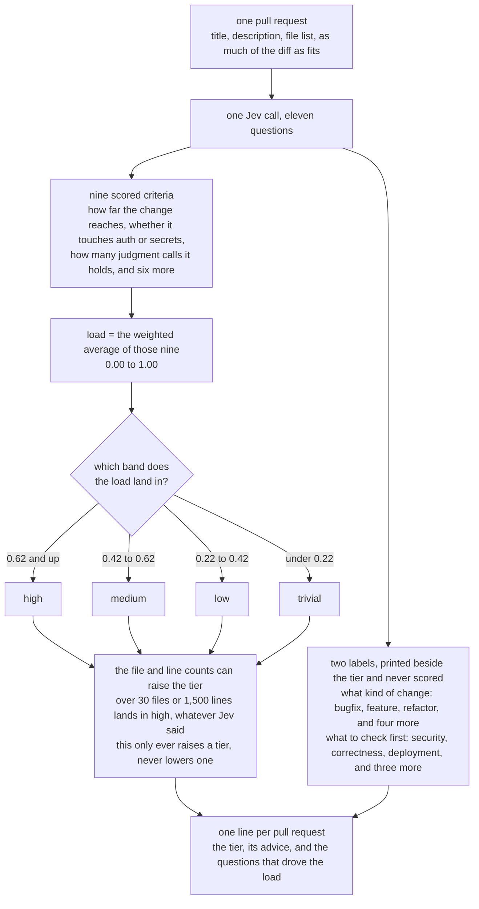

# pr-triage

Sort a repository's open pull requests into four review tiers, one Jev call each.

A maintainer with twenty-six open pull requests wants to know which ones a glance clears and which ones need an hour. The sample sends Jev the title, the description, the file list and as much of the diff as fits, then asks eleven questions about each pull request in one call. Nine of the answers carry a weight, and their average is a review load from 0 to 1. The load picks a tier, Python raises the tier when the change is too big to take Jev's word for it, and each tier carries the advice that goes with it.

Twenty-six pull requests cost $0.0077 and four seconds.

The sample prints the triage and writes a report. Merging stays with you.

## What it asks

Eleven questions go to Jev in one call: how far the change reaches, whether it touches auth or secrets, how many judgment calls a reviewer has to agree with, and eight more. Nine of them carry a weight in [questions.yml](questions.yml), and their weighted average is the load. The table after the diagram names all eleven.



| Question | Type | Weight | What a high answer means |
| --- | --- | --- | --- |
| `change_kind` | Choice | | docs, tests, dependency, config, bugfix, feature or refactor |
| `review_focus` | Choice | | where a reviewer should start |
| `blast_radius` | Score | 0.15 | the change reaches shared code paths |
| `design_decisions` | Score | 0.14 | a reviewer has judgment calls to agree with |
| `security_surface` | Noul | 0.15 | it touches auth, secrets, tokens or input validation |
| `mechanical` | Noul (inverted) | 0.12 | one edit repeated, so checking one instance checks them all |
| `breaking_change` | Noul | 0.11 | an existing caller stops working |
| `scope_creep` | Noul | 0.09 | the diff does things the description never mentions |
| `infra_surface` | Noul | 0.08 | it touches deployment, images or CI |
| `has_tests` | Noul (inverted) | 0.08 | the change comes with tests that exercise it |
| `description_quality` | Score (inverted) | 0.08 | the author explained what, why and how they checked |

`questions.yml` inverts three of them, so a mechanical diff, a covered change and a thorough description each lower the load.

## Running it

```bash
cd samples/pr-triage

# The 10 most recent open pull requests, fetched and triaged in one command
uv run pr_triage.py agentic-community/mcp-gateway-registry

# Every open one, or everything opened in the last 30 days
uv run pr_triage.py owner/repo --all
uv run pr_triage.py owner/repo --since 30
uv run pr_triage.py owner/repo --since 2026-08-01

# Build a dataset once, then triage it as often as you like with no GitHub calls
uv run fetch_prs.py owner/repo --all
uv run pr_triage.py --dataset data/owner-repo-open-all.json

# Every question for one pull request, and what each one contributed
uv run pr_triage.py --dataset data/owner-repo-open-all.json --explain 1693
```

`fetch_prs.py` needs a GitHub token and no Jev key. It reads `GITHUB_TOKEN` or `GH_TOKEN`, and falls back to `gh auth token`. Unauthenticated callers get sixty requests an hour and one pull request costs two of them, so twenty-six pull requests want a token.

`pr_triage.py` needs a Jev key in `TYPESAFE_API_KEY`, from the environment or from `.env` beside the sample or at the repo root.

## What it prints

From a run on 25 September 2026 against the twenty-six open pull requests of [agentic-community/mcp-gateway-registry](https://github.com/agentic-community/mcp-gateway-registry), trimmed to the ends of the table:

```
| PR    | Files | Lines      | Kind    | Load | Tier              | Review focus | Title                                                      |
| ----- | ----- | ---------- | ------- | ---- | ----------------- | ------------ | ---------------------------------------------------------- |
| #610  | 19    | +533/-74   | feature | 0.82 | high              | security     | ALB-direct deployment mode - Public Endpoint with IP fi... |
| #1671 | 12    | +791/-71   | feature | 0.75 | high              | deployment   | feat(charts): keycloak official image                      |
| #1693 | 51    | +3052/-626 | feature | 0.75 | high              | security     | feat(security): Asymmetric (ES256) internal JWT signing    |
| ...                                                                                                                                       |
| #1598 | 1     | +39/-3     | feature | 0.45 | medium            | security     | feat: add static bearer token fast-path for egress auth    |
| #1765 | 6     | +421/-26   | bugfix  | 0.44 | medium            | correctness  | fix(mcpgw): return the custom records and asset metadat... |
| #1713 | 4     | +84/-1     | bugfix  | 0.38 | low               | correctness  | fix(auth): normalize IdP group names before matching sc... |
```

Then the same pull requests grouped by tier, each with the questions that drove its load:

```
HIGH  (13)  -> a human reads this line by line, and the author walks them through it
  #610    load 0.82  ALB-direct deployment mode - Public Endpoint with IP filtering
          blast radius, security surface, design decisions
          https://github.com/agentic-community/mcp-gateway-registry/pull/610

LOW  (1)  -> one reviewer, one pass, no meeting
  #1713   load 0.38  fix(auth): normalize IdP group names before matching scope mappings
          security surface, blast radius, design decisions
          https://github.com/agentic-community/mcp-gateway-registry/pull/1713

26 pull requests, 11 questions each, one call apiece. 183,426 input tokens, 4,230 ms total,
163 ms per call on average, $0.00770 at $0.042 per million input tokens.
10 of 26 had patches too large to send whole, so Jev read part of the diff and the paths of
the rest. Those are the ones the size floor guards.
```

Every run also writes a JSON report to [data/](data/), holding each answer as Jev sent it next to the credit and the tier the sample derived from it.

### One pull request, from eleven answers to one tier

Pull request #610 adds an ALB-direct deployment mode with IP filtering, across 19 files and +533/-74 lines. Jev read 84% of its diff and answered all eleven questions in one call. Nine of them carry weight, and `credit` is what each answer contributed after inversion:

| Question | Jev returned | Weight | Credit | Adds to load |
| --- | --- | --- | --- | --- |
| `blast_radius` | 2.00 / 2 | 0.15 | 1.00 | 0.1500 |
| `security_surface` | 0.99 | 0.15 | 0.99 | 0.1485 |
| `design_decisions` | 1.98 / 2 | 0.14 | 0.99 | 0.1386 |
| `infra_surface` | 0.99 | 0.08 | 0.99 | 0.0792 |
| `has_tests` (inverted) | 0.03 | 0.08 | 0.97 | 0.0776 |
| `mechanical` (inverted) | 0.39 | 0.12 | 0.61 | 0.0732 |
| `breaking_change` | 0.66 | 0.11 | 0.66 | 0.0726 |
| `scope_creep` | 0.58 | 0.09 | 0.58 | 0.0522 |
| `description_quality` (inverted) | 1.18 / 2 | 0.08 | 0.41 | 0.0328 |
| | | **1.00** | | **0.8247** |

The weights sum to 1.00, so the load is that column added up: 0.8247, which the table above prints as 0.82. It sits in the 0.62-and-up band, so #610 lands in high, and the run names its three heaviest rows as the drivers: blast radius, security surface, design decisions.

The inverted rows are where a good answer lowers the load. `has_tests` came back 0.03, so Jev found almost nothing exercising the change, and its credit is 1 minus 0.03. That row adds 0.078, and the same row on a tested change would add close to nothing. `mechanical` at 0.39 says the diff is not one edit repeated, so a reviewer cannot check one instance and stop. `description_quality` is the one row holding the load down: the author explained enough to reach 1.18 out of 2, which leaves a credit of 0.41 where a bare description would have left 0.9 or more.

The two unweighted labels came back `feature` at 0.99 confidence and `security` at 0.95. They tell a reviewer what kind of change this is and where to start, and neither moves the number.

The size floor changed nothing here. Nineteen files sets a floor of medium, under the high the load already earned. Airflow #73713 is the case where it bites: 54 files of one repeated locale-formatting edit score a load of 0.37, which alone would read low, and the floor raises it to high.

## What to notice

**All four tiers get used.** Eighteen recent open pull requests from [apache/airflow](https://github.com/apache/airflow) came out 3 high, 5 medium, 8 low and 2 trivial. The smallest is #73722, a two-line clarification of `max_db_retries` doc wording, which scores 0.21 and lands in trivial. How a queue spreads across the tiers is a fact about the repository, so read your own distribution before you move a cut.

**Nine files can outrank fifty-four.** #73704 changes 89 lines across 9 files and lands in medium at 0.51, because it fixes socket leaks and adds request timeouts across providers: `security_surface` came back 0.84 and `has_tests` 0.03. #73713 changes 598 lines across 54 files and scores 0.37, because `mechanical` came back 0.80 on one locale-formatting edit repeated through the UI, and the change ships tests. The eleven questions sort by what a review has to catch, and the driver line names the question that did it.

**Arithmetic stays in Python.** Jev cannot count, so the file and line totals reach it as a sentence for context, and every threshold on a number lives in [pr_triage.py](pr_triage.py). `SIZE_FLOORS` names the lowest tier a change of a given size can land in: over 30 files or 1,500 lines is high whatever Jev returned. The floor only ever raises a tier, and the output marks the rows where it did, so a reader can see the disagreement instead of inheriting it.

**Say how much of the diff the model read.** Five of those eighteen hold more patch than the 24,000-character budget, so Jev read some files whole and the rest as paths and line counts. `_diff_text` fills the budget with the smallest patches first, because triage asks how far a change reaches and whether one edit repeats, and both of those want breadth. Coverage lands in the report as `diff_coverage` and in the grouped output as a line under any pull request below 70%. The 0.37 on #73713 came from 44% of its diff, which is a weaker claim than the same number across all of it, and the size floor guards those rows.

**Weights are a data change.** Raising `security_surface` to 0.25 means editing one line of `questions.yml`. Moving a tier cut means editing `LOAD_FLOORS`. Both sit in a diff, and neither hides inside a question's wording.

**The description is evidence, and the author wrote it.** An author who opens with "trivial, please merge" is arguing for their own triage. The state names that field `description_written_by_the_author` and `scope_creep` asks whether the diff matches it, which turns the claim into something to check.

**Answers move between runs.** Two runs of the same dataset moved a load by up to 0.03. The tier column marks any load within 0.02 of a cut as `(on a cut)` rather than picking a side, so a pull request sitting on the boundary reads the same way twice.

## Calibrate before you trust a tier

TypeSafe reports 67.8% accuracy on their own benchmark, published September 2026. These tiers are advice about where to spend attention, and nothing here gates a merge. Point the sample at fifty pull requests your team already reviewed, compare the tiers against what those reviews cost, and move the cuts in `LOAD_FLOORS` until they match your repository. [jevcal](https://github.com/abhixhek/jevcal) turns that comparison into a measurement.
